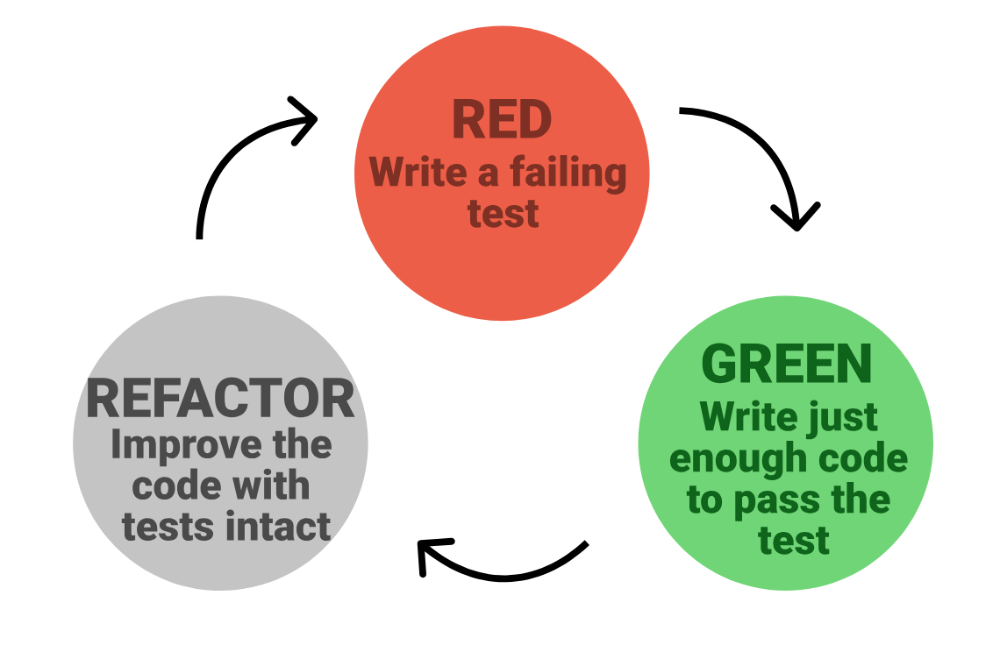

:::::::::::::::::::::::::::::::::::::: questions 

- Why should you write tests first?
- What are the 3 phases of TDD?

::::::::::::::::::::::::::::::::::::::::::::::::

::::::::::::::::::::::::::::::::::::: objectives

- Start running tests with pytest.
- Replace the end-to-end test with a pytest version.

::::::::::::::::::::::::::::::::::::::::::::::::


## The Ultimate Challenge (Sort Of)

Welcome! We are going to kick things off with a practical coding challenge. No slides, no long lectures—just you, some code, and a classic geometry problem.

Here is your task:

> **Build a Python function that determines whether two 2D rectangles overlap.**

That is it. That is the entire specification. 

If you are thinking, *"Wait, that's incredibly vague,"* you are exactly right. It is completely ill-defined, but it is entirely comprehensible. How do we represent a rectangle? What are the inputs? What does the function return? 

Before we write a single line of code, we need to clear up the ambiguity.

::: challenge ## Pre-Task: The 3-Minute Q&A Prep (5 mins)

1. Get into groups of 2 or 3.
2. Take **5 minutes** to look at this prompt and figure out what questions you need to ask me (the instructor) to actually build this. What details are missing?
3. We will then hold a **3-minute rapid-fire Q&A** where you can ask me absolutely anything you want to pin down the requirements.
:::

*(Go ahead and run the 3-minute Q&A now with your instructor!)*

---

## The Curveball

Now that we have had our Q&A and you have a rough idea of what we are building, here is the curveball:

**I do not want you to write the function.**

At least, not yet. Instead, I want you to write **tests** for the function. 

Writing tests before writing code might feel backward, but there is a profound method to this madness. To do this, we need a quick primer on what a test actually looks like under the hood.

### Anatomy of a Test: The "AAA" Pattern

A good test is a self-contained story. In the software world, we structure this story using the **AAA (Arrange, Act, Assert)** pattern:

1. **Arrange:** Set up the initial conditions. Create the data structures, variables, or inputs your code needs.
2. **Act:** Run the actual function or calculation you want to test.
3. **Assert:** Check the result. In Python, we do this using the `assert` keyword. If the statement after `assert` is `True`, nothing happens and the test passes. If it is `False`, Python raises an `AssertionError` and the test fails.

Here is a quick conceptual example of what this looks like:

```python
def test_addition():
    # 1. Arrange
    x = 2
    y = 3
    
    # 2. Act
    result = x + y
    
    # 3. Assert
    assert result == 5
```

### Writing Rules for Our Project

To write these tests, we need to establish a few basic rules and folder structures so our test runner can find them:

* **The Workspace:** Create a dedicated folder on your computer named `testing2026`. Do all your work inside this directory.
* **The Test File:** Create a file in that folder named `test_overlap.py`.
* **The Naming Convention:** Pytest (our test runner) is picky. It will only look for tests if the file name starts with `test_` and the test functions themselves start with `test_`.

::: challenge ## Exercise: Write the Tests (5 mins)

Open your editor, navigate to your `testing2026` folder, and write at least **three different test cases** inside `test_overlap.py`. 

* Think of different scenarios: two rectangles that clearly overlap, two that are miles apart, etc.
* Remember, you don't have the actual `overlap.py` file or the overlap function yet! You will have to *pretend* it exists. You will need to import it at the top of your test file (e.g., `from overlap import check_overlap`).
* Don't run anything yet—just write the test code!
:::

---

## Running the Tests (and Watching Them Fail)

To run these tests, we are going to use a Python library called `pytest`. If you don't have it installed yet, install it now from your terminal:

```bash
pip install pytest
```

Now, navigate to your `testing2026` folder in your terminal and run the test runner:

```bash
pytest
```

Unsurprisingly, your tests should spectacularly fail. You will likely see a giant red error screaming `ModuleNotFoundError: No module named 'overlap'`.

Of course they failed! We haven't written a single line of the actual overlap math yet. 

---

## Testing is a Design Tool

Take a step back and think about what just happened. To write those failing tests, you were forced to make a series of critical **design decisions** before you wrote any implementation logic.

Ask yourself:
* **What did you call your function?** Was it `check_overlap`, `is_overlapping`, or just `overlap`?
* **How did you represent a rectangle?** Did you pass in four separate coordinates `(x1, y1, x2, y2)`? Did you pass in tuples? Did you represent them as a custom class, or perhaps center coordinates with a width and height?
* **What does the function return?** Does it return a boolean (`True`/`False`), or does it return the area of the overlap?

This is the first major realization of Test-Driven Development: **Testing is not just a verification phase. Testing is a design tool.**

By writing the tests first, you forced yourself to become the *user* of your own API before you became the *creator*. You designed a clean, logical interface without being distracted by the complicated coordinate math.

---

## The TDD Cycle

What we just did is the first step of **Test-Driven Development (TDD)**. TDD is a highly disciplined software workflow built on a tight, repeating three-step loop:

{alt="Cycle with three nodes: 'Red (write a failing test)', followed by 'Green (write just enough code to pass the test)', followed by 'Refactor (improve the code with tests intact)', then back to Red"}


1. **RED:** Write a test for a behavior you want, run it, and watch it fail.
2. **GREEN:** Write the absolute simplest, dirtiest code possible to make the test pass.
3. **REFACTOR:** Clean up your code, remove duplication, and improve the design while keeping the tests green.

---

## Exercise: Write Code Until Things Go Green!

Now that you have your failing tests (Red) and you have locked down your design decisions, it is finally time to write the actual math.

::: challenge ## Exercise: Get to Green (10 mins)

1. Create a new file named `overlap.py` in your `testing2026` folder.
2. Define the overlap function using the exact name and coordinate structure you decided on in your `test_overlap.py` file.
3. Implement the logic to detect whether the rectangles overlap.
4. Run `pytest` in your terminal.
5. If it fails, tweak your math inside `overlap.py` until the terminal turns beautiful, satisfying green.
:::

::::::::::::::::::::::::::::::::::::: keypoints 

- TDD cycles between the phases red, green, and refactor
- TDD cycles should be fast, run tests on every write
- Writing tests first ensures you *have* tests and that they are working
- Making code testable forces better style
- It is much faster to work with code under test

::::::::::::::::::::::::::::::::::::::::::::::::
